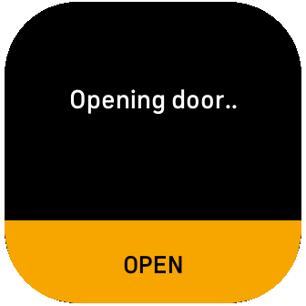
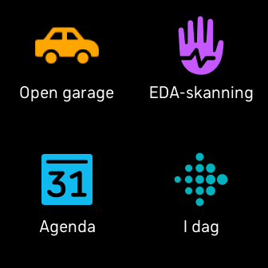

# Garage door opener




## Development setup

First time:
```
sudo apt install gnome-keyring
npx fitbit-build
```

Every time:
```shell
# Start fitbit shell
npx fitbit

# Build and install app
fitbit$ bi
```

## Deployment
1. Build app using the instructions above
2. Log in to - https://gam.fitbit.com
3. Create app and upload `build/app.fba- https://gam.fitbit.com/`


## Resources
- https://studio.fitbit.com
- https://dev.fitbit.com/build/guides/command-line-interface/
